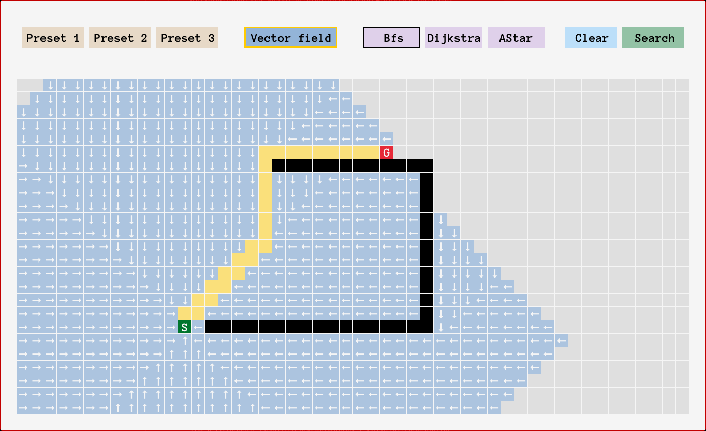

# Shortest-Path-raylib

This is an improvement to my [Shortest-path GUI](https://github.com/einheitsviktor/Shortest-Path) implemented in Qt.
This time I use [raylib](https://www.raylib.com/) ("... a simple and easy-to-use library to enjoy videogames programming.") to make the interactions more convenient.
<!-- This is my attempt to implement a GUI in C++ to find the shortest path in a two-dimensional field. -->

Regarding the logic I followed this [guide](https://www.redblobgames.com/pathfinding/a-star/introduction.html) very closely.

## Dependencies for Running Locally
* cmake >= 3.11
* make >= 4.1 (Linux)
  * Linux: make is installed by default on most Linux distros
* gcc/g++ >= 8.0
  * Linux: gcc / g++ is installed by default on most Linux distros

## Basic Build Instructions

1. Clone this repo: `git clone --recurse-submodules https://github.com/einheitsviktor/Shortest-Path-raylib.git`
2. Make a build directory in the top level directory: `mkdir build && cd build`
3. Compile: `cmake .. && make`
4. Run: `./Shortest-Path`

## Usage
###TODO...
